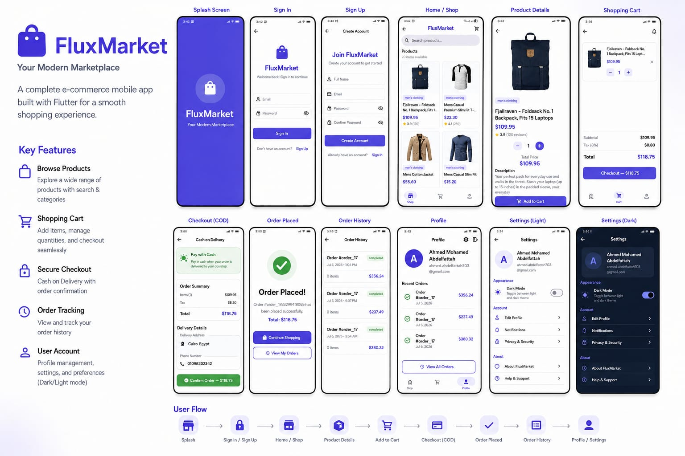

# FluxMarket 🛍️

[](https://flutter.dev)
[](https://dart.dev)
[](https://bloclibrary.dev)
[](https://blog.cleancoder.com/uncle-bob/2012/08/13/the-clean-architecture.html)
[](LICENSE)

> **A professional-grade E-commerce mobile application** built with Flutter, showcasing Clean Architecture, BLoC state management, and modern software engineering best practices.

---

## 📑 Table of Contents

- [Architecture Overview](#-architecture-overview)
- [Tech Stack & Architecture](#-tech-stack--architecture)
- [Project Structure](#-project-structure)
- [Features](#-features)
- [Screenshots](#-screenshots)
- [How to Run](#-how-to-run)
- [Code Quality & Conventions](#-code-quality--conventions)
- [Animations & UX](#-animations--ux)
- [Testing](#-testing)
- [Roadmap](#-roadmap)
- [Contributing](#-contributing)
- [License](#-license)

---

## 🏗 Architecture Overview

**FluxMarket** follows **Clean Architecture** principles, dividing the codebase into three main layers, each with strict dependency rules:

```
┌─────────────────────────────────────────────────┐
│                  PRESENTATION                   │
│   (BLoC / UI / Pages / Widgets)                │
│         ↕ depends on                           │
├─────────────────────────────────────────────────┤
│                    DOMAIN                         │
│   (Entities / Use Cases / Repositories)          │
│         ↕ depends on                           │
├─────────────────────────────────────────────────┤
│                     DATA                        │
│   (DataSources / Models / Repository Impl)      │
│         ↕                                      │
│   🌐 Remote (Dio)       💾 Local (Hive)        │
└─────────────────────────────────────────────────┘
```

### 🔑 Key Principles

- **Dependency Inversion**: High-level modules don't depend on low-level modules. Both depend on abstractions.
- **Separation of Concerns**: Each layer has a distinct responsibility, making the codebase highly testable and maintainable.
- **Unidirectional Data Flow**: UI → BLoC → Repository → DataSource → BLoC → UI.

---

## 🛠 Tech Stack & Architecture

| Layer | Technology | Purpose |
|-------|------------|---------|
| **Framework** | Flutter 3.12+ | Cross-platform mobile development |
| **Language** | Dart 3.12+ | Sound null safety, pattern matching |
| **State Management** | flutter_bloc 9.x | Predictable, testable state management |
| **Dependency Injection** | get_it + injectable | Compile-time safe DI |
| **Networking** | Dio 5.x | HTTP client with interceptors & retry |
| **Local Storage** | Hive 2.x | Fast NoSQL database for caching |
| **Routing** | MaterialPageRoute | Simple, declarative navigation |
| **Animation** | Lottie + Flutter Animations | Rich, performant animations |
| **Error Handling** | dartz (Either) | Functional, type-safe error handling |
| **UI Components** | google_fonts, shimmer | Beautiful, modern UI |

---

## 📂 Project Structure

```
lib/
├── core/                           # Shared core layer
│   ├── error/                      # Failure & exception definitions
│   │   ├── failures.dart           # Server, Cache, Network, Unknown failures
│   │   └── exceptions.dart         # Custom exception classes
│   ├── network/
│   │   └── network_info.dart       # Connectivity checker
│   ├── theme/
│   │   └── app_theme.dart          # Light & dark themes, spacing constants
│   ├── utils/
│   │   └── constants.dart          # App-wide constants
│   └── widgets/                    # Reusable global widgets
│       ├── app_error_widget.dart   # Global error display widget
│       ├── snack_message.dart      # Snackbar helper
│       └── staggered_grid_view.dart# Staggered animation grid
│
├── features/                       # Feature modules
│   ├── auth/                       # Authentication feature
│   │   ├── data/
│   │   │   ├── datasources/        # Remote & local auth data sources
│   │   │   ├── models/             # Auth model
│   │   │   └── repositories/       # Auth repository implementation
│   │   ├── domain/
│   │   │   ├── entities/           # User entity
│   │   │   ├── repositories/       # Auth repository abstract class
│   │   │   └── usecases/           # Login, Register use cases
│   │   └── presentation/
│   │       ├── bloc/               # AuthBloc (event → state)
│   │       └── pages/              # Login, Register pages
│   │
│   ├── home/                       # Products / Home feature
│   │   ├── data/
│   │   │   ├── datasources/        # Remote product data source
│   │   │   ├── models/             # Product model
│   │   │   └── repositories/       # Home repository implementation
│   │   ├── domain/
│   │   │   ├── entities/           # Product entity
│   │   │   ├── repositories/       # Home repository abstract class
│   │   │   └── usecases/           # Get products use case
│   │   └── presentation/
│   │       ├── bloc/               # HomeBloc (event → state)
│   │       ├── pages/              # Home, Product Detail pages
│   │       └── widgets/            # ProductCard, shimmer, grid
│   │
│   ├── cart/                       # Shopping Cart feature
│   │   ├── data/
│   │   │   ├── datasources/        # Hive local data source
│   │   │   ├── models/             # Cart item model
│   │   │   └── repositories/       # Cart repository implementation
│   │   ├── domain/
│   │   │   ├── entities/           # Cart item entity
│   │   │   ├── repositories/       # Cart repository abstract class
│   │   │   └── usecases/           # Add/Remove/Get/Clear cart
│   │   └── presentation/
│   │       ├── bloc/               # CartBloc (event → state)
│   │       └── pages/              # Cart page
│   │
│   ├── checkout/                   # Checkout & Orders feature
│   │   ├── data/
│   │   │   ├── datasources/        # Order history data source
│   │   │   ├── models/             # Order model
│   │   │   └── repositories/       # Order repository implementation
│   │   ├── domain/
│   │   │   ├── entities/           # Order entity
│   │   │   ├── repositories/       # Order repository abstract class
│   │   │   └── usecases/           # Place order, get orders
│   │   └── presentation/
│   │       ├── bloc/               # CheckoutBloc (event → state)
│   │       └── pages/              # Checkout page, Order history
│   │
│   └── profile/                    # User Profile feature
│       ├── data/
│       │   ├── datasources/
│       │   ├── models/
│       │   └── repositories/
│       ├── domain/
│       │   ├── entities/
│       │   ├── repositories/
│       │   └── usecases/
│       └── presentation/
│           ├── bloc/
│           └── pages/
│
├── injection_container.dart        # GetIt DI configuration
└── main.dart                       # App entry point
```

---

## ✨ Features

### ✅ Implemented

- **User Authentication** — Login & registration with form validation
- **Product Catalog** — Browse products in a responsive grid with shimmer loading
- **Product Search & Filtering** — Real-time search with debounce, filter by name/category/description
- **Product Detail** — Full product info with Hero image transition & animated "Add to Cart"
- **Shopping Cart** — Manage items, quantities, order summary, with Lottie empty-state animation
- **Checkout Flow** — Delivery details collection with mock payment processing
- **Order History** — Track completed orders persisted locally with Hive
- **Responsive Grid** — Adapts columns (2/3/4) based on screen width
- **Staggered Animations** — Cascading fade-in + slide-up for product grid items
- **Scale Animation** — Press-feedback animation on the "Add to Cart" button
- **Lottie Animation** — Engaging empty cart state with a looping Lottie animation
- **Global Error Widget** — Reusable `AppErrorWidget` for consistent error UIs
- **Snackbar System** — Typed `SnackMessage` helper (success, error, warning, info)
- **Dark Mode** — Full dark theme support
- **Error Handling** — Functional `Either` pattern with typed failure classes
- **Caching** — Product & cart data persisted locally with Hive
- **Network Awareness** — Offline detection with connectivity_plus

### 🔜 Planned

- Push notifications
- CI/CD with GitHub Actions
- Unit & widget tests
- Firebase backend integration

---

## 📸 Screenshots



---

## 🚀 How to Run

### Prerequisites

- Flutter SDK 3.12+
- Dart 3.12+
- Android Studio / VS Code

### Installation

```bash
# Clone the repository
git clone https://github.com/negro703/fluxmarket
cd fluxmarket

# Install dependencies
flutter pub get

# Generate code (injectable, freezed - if applicable)
dart run build_runner build --delete-conflicting-outputs

# Run the app
flutter run
```

### Run on Specific Platform

```bash
# Android
flutter run -d android

# iOS (requires macOS)
flutter run -d ios

# Web
flutter run -d chrome

# Windows
flutter run -d windows
```

### Build for Production

```bash
# Android APK
flutter build apk --release

# Android App Bundle
flutter build appbundle --release

# iOS (requires macOS)
flutter build ios --release

# Web
flutter build web --release
```

### Run Tests

```bash
# Run all tests
flutter test

# Run with coverage
flutter test --coverage
genhtml coverage/lcov.info -o coverage/html
open coverage/html/index.html
```

---

## 🧪 Code Quality & Conventions

### Dart Style Guide

- **80-character line limit** for readability
- **PascalCase** for classes, enums, and type aliases
- **camelCase** for variables, methods, and parameters
- **SCREAMING_CASE** for constants
- **Trailing commas** for cleaner diffs
- **`const`** wherever possible for performance

### Architecture Rules

- ✅ BLoCs are **pure Dart** — no Flutter dependency
- ✅ Use cases encapsulate **single business operation**
- ✅ Repositories are **abstract** in domain, **concrete** in data
- ✅ Data sources return **models**; domain works with **entities**
- ✅ All cross-cutting concerns (theme, DI, networking) live in **core/**
- ✅ **No business logic** in widgets — only BLoC events & states

### Naming Conventions

- **Files**: `snake_case` (e.g., `product_card.dart`)
- **Types**: `PascalCase` (e.g., `ProductCard`)
- **Methods**: `camelCase` (e.g., `_buildProductGrid`)
- **Private**: Prefix with `_` (e.g., `_CartEmptyView`)
- **BLoC**: `XxxBloc`, `XxxEvent`, `XxxState`
- **Use Cases**: `VerbNounUsecase` (e.g., `GetProductsUsecase`)

---

## 🎬 Animations & UX

| Animation | Location | Implementation |
|-----------|----------|----------------|
| **Staggered Grid** | HomePage product grid | `StaggeredGridView` — sequential fade-in + slide-up |
| **Scale Button** | ProductDetailPage "Add to Cart" | `AnimationController` with scale transform |
| **Bounce Empty Cart** | CartPage empty state | `AnimationController` with bounce effect |
| **Hero** | ProductCard → ProductDetailPage | Flutter's built-in `Hero` widget |
| **Shimmer Loading** | HomePage initial load | `shimmer` package with skeleton placeholders |

---

## 🧪 Testing

```bash
# Run all tests
flutter test

# Run with coverage
flutter test --coverage
```

### Test Strategy

- **Unit Tests**: BLoCs, Use Cases, Repositories, DataSources
- **Widget Tests**: Pages, Widgets, custom components
- **Integration Tests**: Full feature flows

---

## 🗺 Roadmap

| Status | Milestone |
|--------|-----------|
| ✅ | Project scaffolding & architecture setup |
| ✅ | Core layer (networking, theme, error handling) |
| ✅ | Authentication feature (login/register) |
| ✅ | Product catalog & detail pages |
| ✅ | Product search & filtering |
| ✅ | Shopping cart with Hive persistence |
| ✅ | Animations & UI polish |
| ✅ | Checkout & order simulation (mock payment) |
| ✅ | Order history tracking |
| ✅ | Firebase backend integration |

---

## 🤝 Contributing

1. Fork the repository
2. Create your feature branch (`git checkout -b feature/amazing-feature`)
3. Commit your changes (`git commit -m 'feat: add amazing feature'`)
4. Push to the branch (`git push origin feature/amazing-feature`)
5. Open a Pull Request

### Commit Convention

We follow [Conventional Commits](https://www.conventionalcommits.org/):

- `feat:` — A new feature
- `fix:` — A bug fix
- `chore:` — Maintenance tasks
- `docs:` — Documentation changes
- `refactor:` — Code refactoring
- `test:` — Adding or updating tests
- `style:` — Code style changes (formatting, etc.)

---

## 📄 License

Distributed under the **MIT License**. See `LICENSE` for more information.

---

## 🙏 Acknowledgements

- [Clean Architecture by Robert C. Martin](https://blog.cleancoder.com/uncle-bob/2012/08/13/the-clean-architecture.html)
- [BLoC Library](https://bloclibrary.dev) by Felix Angelov
- [Flutter](https://flutter.dev) team at Google
- All open-source packages used in this project

